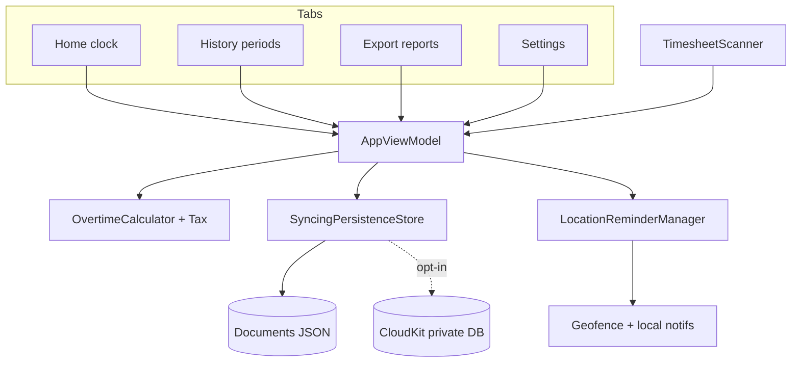

# HoursTracker iOS — Agent Brief (Summary + Architecture Map)

Hand this file to another AI agent as project context. Repo root:

`/Users/humussalad/FingerPrint`

Deeper detail (keep in sync): `docs/ARCHITECTURE.md`, `FEATURES` via README + this brief, `docs/ROADMAP.md`.

---

## 1. One-line purpose

**HoursTracker** is a single-worker iOS time clock that records shifts and estimates **gross + net pay under Israeli labor / tax rules** (OT tiers, rest day, holiday, night shift, unpaid breaks, credit points). Localized **English / Hebrew / Arabic** (RTL). Optional geofence reminders, timesheet OCR import, multi-format export, optional iCloud sync (off by default).

---

## 2. Product facts

| Field | Value |
|--------|--------|
| Display name | **HoursTracker** (`CFBundleDisplayName` / `L10n.brandName` / App Store) |
| Home wordmark | Stylized “Hours” + “Tracker” in `HomeBrandTitle` (same name, two colors) |
| Bundle ID | `com.hourstracker.app` |
| Version | `1.0` (`CFBundleShortVersionString`) |
| Build | `13` (`CFBundleVersion` in `project.yml`) |
| Min OS | iOS 17.0 |
| UI | SwiftUI, 4-tab `TabView`, **MVVM** |
| Project gen | **XcodeGen** — edit `project.yml`, then `xcodegen generate` |
| Team | `FQUC6DU87N` (in `project.yml`) |
| Tests | `HoursTrackerTests` (XCTest) |
| CI | `.github/workflows/ci.yml` — xcodegen + xcodebuild test + SwiftLint + gitleaks |

---

## 3. Repo map

```
FingerPrint/
├── project.yml                 # ★ source of truth for Xcode project
├── HoursTracker.xcodeproj/     # generated — do not hand-edit; regenerate
├── HoursTracker/               # ★ app source
│   ├── HoursTrackerApp.swift   # @main + MainTabView
│   ├── Models/
│   ├── Managers/
│   ├── ViewModels/AppViewModel.swift
│   ├── Views/
│   ├── Utilities/
│   ├── Resources/              # xcstrings, privacy, assets
│   └── HoursTracker.entitlements
├── HoursTrackerTests/
├── AppStoreScreenshots/
├── docs/
│   ├── ARCHITECTURE.md         # long-form architecture
│   ├── IOS_APP_AGENT_BRIEF.md  # ← this file
│   ├── ROADMAP.md
│   ├── PRIVACY.md
│   ├── DATA_INVENTORY.md
│   └── HARDENING_*.md
├── SECURITY.md
└── scripts/
```

**Always regenerate after `project.yml` changes:**

```bash
xcodegen generate
open HoursTracker.xcodeproj
```

---

## 4. Navigation map (tabs)

```
HoursTrackerApp
├── LaunchHourglassSplash ( ~2.1s )
├── AppLockView (optional Face ID / Touch ID)
├── PrivacyOverlayView (app switcher redact)
└── MainTabView (id remounts on language change)
    ├── Home        → HomeView.swift (+ HomeVitalityViews.swift)
    ├── History     → HistoryView.swift
    ├── Export      → ExportView.swift
    └── Settings    → SettingsView.swift
```

**Sheets / secondary flows (not tabs)**

| Flow | File |
|------|------|
| Day summary after clock-out | `DaySummarySheet` in `HomeView.swift` |
| Shift detail / edit | `ShiftDetailSheet.swift` |
| Manual entry | `ManualEntryView.swift` |
| Timesheet OCR | `TimesheetScannerView.swift` |
| Import conflict | `ImportConflictPopup.swift` |
| Activity log | `ActivityLogView.swift` |
| Full data export | `FullDataExportSheet.swift` |
| Privacy policy | `PrivacyPolicyView.swift` |
| Blank timesheet helper | `BlankTimesheetEntryView.swift` |

---

## 5. Architecture map

```
┌─────────────────── SwiftUI Views ───────────────────┐
│  HomeView   HistoryView   ExportView   SettingsView │
└───────────────────────┬─────────────────────────────┘
                        │ @ObservedObject
                ┌───────▼────────┐
                │  AppViewModel  │  @MainActor — sessions + settings
                └───┬───────┬────┘
        ┌───────────┘       └──────────────┐
┌───────▼─────────┐              ┌─────────▼────────────────┐
│ SyncingStore    │              │ LocationReminderManaging │
│ SyncingPersist- │              │ LocationReminderManager  │
│ enceStore       │              └──────────────────────────┘
└───┬─────────┬───┘
    │ local   │ cloud (opt-in / often compiled out)
┌───▼──────┐  ┌───▼────────────────┐
│Persist.  │  │CloudKitSyncManager │
│Manager   │  │ or NoOp stub       │
└──────────┘  └────────────────────┘
```

**Pattern:** MVVM + protocol-injected managers (testable via `TestDoubles.swift`).

**Key protocols:** `PersistableStore`, `SyncingStore`, `CloudSyncing`, `LocationReminderManaging`.

### Mutation flow

1. View calls `AppViewModel` (e.g. `clockOut()`).
2. VM mutates `@Published sessions` / `settings`, calls `persist()`.
3. `SyncingPersistenceStore` writes JSON locally (sync, throws on failure → alert).
4. Diff → background CloudKit upload **only if** CloudKit compiled in **and** user enabled iCloud sync.
5. `refreshReminders()` reschedules geofence + local notifications.

---

## 6. Feature map

### Home
- Clock in / out, live timer (from `WorkSession.elapsedSeconds`)
- Weekly sparkline (real `dailyHours`, not decorative distortion)
- Day summary sheet for **that shift only** after clock-out (delete allowed)
- Personalized greeting uses Settings worker name when set

### History
- Payroll-period browser (`HistoryPeriodHelper` + `payrollStartDay`)
- Health-style day strip + week rows
- Per-shift pay breakdown; edit/delete
- Gross / net toggle

### Export
- Ranges: all / month / year / custom
- Formats: **PDF, TXT, Markdown, DOCX, CSV**
- Report language independent of UI (`ExportLanguage` + `ExportCopy`)
- PDF/DOCX/TXT layout respects RTL for he/ar (`ExportLayout`)
- Share sheet; temps wiped on background / launch (`ExportTempFileStore`)

### Settings
- Worker identity (name, Israeli ID in **Keychain** only)
- Rates, OT rules, breaks, rest day, night, currency
- Tax / marital / credit points
- Geofence workplace + arrival reminders
- App language: System / English / עברית / العربية (`AppLanguagePreference`)
- App Lock (biometrics)
- Cloud sync toggle (hidden when unsupported)
- Activity log, privacy, delete all data, full data export

### Import
- Vision OCR timesheet scan → review drafts → import
- Conflict popup for days that already have sessions
- Swapped in/out correction only for scanner / manual wheels (`resolveClockPair`)

### Reminders
1. Arrival geofence → “Did you clock in?”
2. Predicted clock-out (avg last sessions)
3. 23:00 forgot-to-clock-out

---

## 7. Pay engine (domain critical)

`OvertimeCalculator` — per **calendar day**, effective hours = clocked − unpaid break.

| Tier | Regular | Rest / holiday | Capacity |
|------|---------|----------------|----------|
| Base | 100% | 150% | `standardDayHours` (8.6h; **7h** night) |
| T1 | 125% | 175% | `ot125HoursCap` (2h) |
| T2 | 150% | 200% | unlimited |

- Multiple sessions/day share one OT + gas allowance (clock-in order).
- Night auto-detect: ≥ 2h between 22:00–06:00.
- Default break auto-applied for shifts ≥ 6h (editable).
- Net ≈ `IsraeliTaxEstimator` + `TaxCreditPointsCalculator` (estimate, not official payroll).

**Entry points:** `breakdowns(forDay:)`, `breakdown(for:in:)`, `aggregate(sessions:)`.

---

## 8. Data & security rules (agents must respect)

| Data | Where |
|------|--------|
| Sessions | Documents JSON via `ProtectedFileWriter` |
| Settings | Documents JSON (worker ID stripped) |
| Israeli ID | **Keychain only** (`KeychainStore`) — never CloudKit / JSON |
| Tombstones | `session_tombstones.json` (deleted IDs, 90-day prune) |
| Activity log | No PII / GPS / free-text notes in details |
| Export temps | `ExportTempFileStore` — wipe aggressively |
| Corrupt JSON | Quarantine to `.corrupt` sibling, don’t overwrite |

CloudKit: **compiled out** unless `HTCloudKitEnabled` + entitlements; even then user toggle default **off**.

---

## 9. Localization map

| Mechanism | Use |
|-----------|-----|
| `Localizable.xcstrings` + `L10n` | UI strings — load from `en`/`he`/`ar` bundles via app language |
| `AppLocale` | Notification strings + resolved locale for dates |
| `ExportCopy` | Report strings (language independent of UI) |
| `AppLanguagePreference` / `AppLanguageController` | In-app language override; remounts `MainTabView` |

RTL: Hebrew + Arabic. Export layout flips for he/ar independently of device language.

---

## 10. Key files index

| Concern | Path |
|---------|------|
| App entry / tabs | `HoursTracker/HoursTrackerApp.swift` |
| View model | `HoursTracker/ViewModels/AppViewModel.swift` |
| Session model | `HoursTracker/Models/WorkSession.swift` |
| Settings model | `HoursTracker/Models/WorkplaceSettings.swift` |
| Pay engine | `HoursTracker/Models/OvertimeCalculator.swift` |
| Tax estimate | `HoursTracker/Models/IsraeliTaxEstimator.swift` |
| Persistence | `HoursTracker/Managers/PersistenceManager.swift` |
| Sync facade | `HoursTracker/Managers/SyncingPersistenceStore.swift` |
| CloudKit | `HoursTracker/Managers/CloudKitSyncManager.swift` |
| Location / notifs | `HoursTracker/Managers/LocationReminderManager.swift` |
| Export | `HoursTracker/Managers/ExportManager.swift` |
| OCR | `HoursTracker/Managers/TimesheetScannerManager.swift` |
| L10n | `HoursTracker/Utilities/L10n.swift` |
| App language | `HoursTracker/Utilities/AppLanguagePreference.swift` |
| Home UI | `HoursTracker/Views/HomeView.swift` |
| Home chrome | `HoursTracker/Views/HomeVitalityViews.swift` |
| History | `HoursTracker/Views/HistoryView.swift` |
| Project config | `project.yml` |

---

## 11. Flow diagram



---

## 12. Agent rules of engagement

1. **SwiftUI + MVVM** — mutate state through `AppViewModel`; keep managers protocol-backed.
2. **Regenerate Xcode project** from `project.yml` — don’t hand-edit `.pbxproj` unless necessary.
3. **Pay math is sacred** — change `OvertimeCalculator` only with tests (`OvertimeCalculatorTests`, `PayRulesTests`).
4. **Never store Israeli ID in JSON/CloudKit** — Keychain only.
5. **Activity log: no PII.**
6. **Localization:** add keys to `Localizable.xcstrings` + `L10n`; notifications → `AppLocale`; exports → `ExportCopy`.
7. **RTL:** test he/ar; export uses `ExportLayout`, not device locale alone.
8. Prefer matching existing patterns (toasts, error alerts, protected file writer).
9. If this brief conflicts with code, trust the code and update `docs/ARCHITECTURE.md` + this brief.

---

## 13. Build / test commands

```bash
cd /Users/humussalad/FingerPrint
xcodegen generate
xcodebuild test -scheme HoursTracker -destination 'platform=iOS Simulator,name=iPhone 16'
```

Geofence / Always location: test on a **physical device**.

---

## 14. Related docs

| Doc | Contents |
|-----|----------|
| `docs/ARCHITECTURE.md` | Full subsystem deep-dive |
| `docs/WATCH_APP_AGENT_BRIEF.md` | Apple Watch companion (add-on target; WCSession, not CloudKit) |
| `docs/ROADMAP.md` | Phased plan / what’s open |
| `docs/PRIVACY.md` | Privacy policy source |
| `docs/DATA_INVENTORY.md` | What data is stored where |
| `docs/THREAT_MODEL.md` | Security assumptions |
| `SECURITY.md` | Security overview |
| `README.md` | Quick start |

---

*Agent handoff brief for HoursTracker. Prefer `docs/ARCHITECTURE.md` for deep detail; prefer this file for orientation.*
